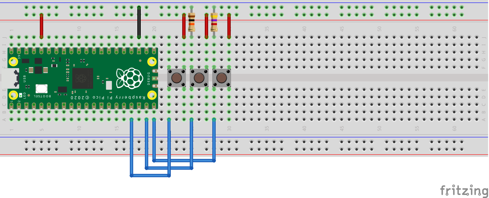

# Demos/Testes com a Raspberry Pi Pico 2

Os programas foram feitos usando o SDK v 2.0. 

## picobench

Um agrupado de três benchmarks: cálculo do pi (inteiros),  linpack (ponto flutuante precisão simples) e wheatstones (ponto flutuante com precisão dupla), para fazer uma comparação (grosseira) entre o RP2040 (ARM Cortex-M0+), RP2350 (ARM Cortex-M33) e (RISC-V Hazard3).

É importante usar o gcc compilado para o Hazard3, conforme descrito na documentação do RP2350.

A saída é enviada para a serial virtual na USB.

## gpiobug

Teste do infame bug no GPIO do RP2350. A montagem para o teste é a seguinte:

Devido ao bug, ao pressionar o botão sem pull-down externo a leitura fica "presa" em 1. Experimente alterar o valor do resistor de 10k para ver qual o maior valor para o resistor de pull-down que funciona (no meu teste funcionou ok com 10k, mas a Raspberry Pi recomenda 8,2k ou menos).

A saída é enviada para a serial virtual na USB.

